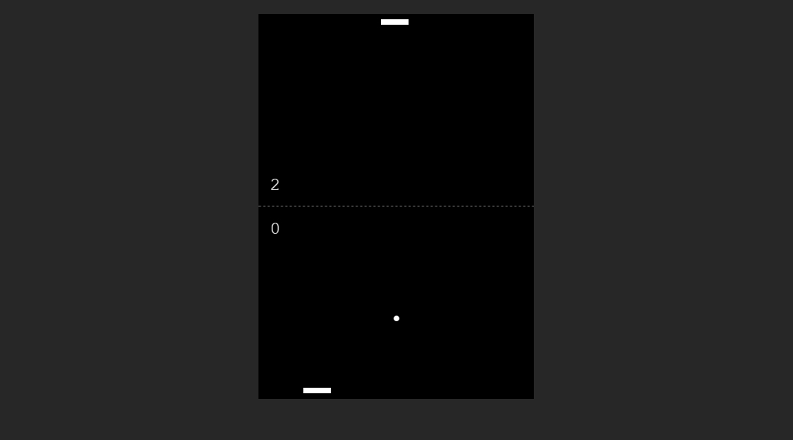

# Pong | ZTM JS Web Projects Course

**Project 20/20**

A classic Pong Game Clone built with HTML, CSS, and JavaScript using the Canvas API. It features smooth gameplay, computer AI, dynamic ball physics, and a simple restart option.

---

## 📚 Table of Contents

- [🔎 Overview](#-overview)
  - [📸 Screenshot](#-screenshot)
  - [🔗 Links](#-links)
  - [📌 Features](#-features)
  - [🛠️ Built with](#️-built-with)
- [🧠 My process](#-my-process)
  - [🗃️ Useful resources](#️-useful-resources)
  - [🔙 Previous Project](#-previous-project)
- [👤 Author](#-author)
  - [🌐 Connect with Me](#-connect-with-me)
  - [💻 Coding Profiles](#-coding-profiles)

---

## 🔎 Overview

### 📸 Screenshot

### 🔗 Links

- [🔴 Live Demo](https://dalascript.github.io/pong/)
- [🗂️ GitHub Repository](https://github.com/DalaScript/pong)

### 📌 Features

- ✅ Play against a computer opponent
- ✅ Mouse-controlled paddle
- ✅ Computer AI with smooth tracking
- ✅ Dynamic ball speed and direction
- ✅ Score system with win condition
- ✅ Restart option after game over

### 🛠️ Built with

- HTML5
- CSS3
- JavaScript
- Canvas API

---

## 🧠 My Process

### 🗃️ Useful resources

- [MDN – Canvas Drawing Shapes](https://developer.mozilla.org/en-US/docs/Web/API/Canvas_API/Tutorial/Drawing_shapes)
- [MDN – CanvasRenderingContext2D](https://developer.mozilla.org/en-US/docs/Web/API/CanvasRenderingContext2D)
- [CSS-Tricks – requestAnimationFrame](https://css-tricks.com/using-requestanimationframe/)
- [Google Developers – Optimize JavaScript Execution](https://developers.google.com/web/fundamentals/performance/rendering/optimize-javascript-execution)
- [MDN – Window.requestAnimationFrame](https://developer.mozilla.org/en-US/docs/Web/API/Window/requestAnimationFrame)

### 🔙 Previous Project

- Paint Clone | *Project 19/20* → [View Repository](https://github.com/DalaScript/paint-clone)

---

## 👤 Author

### 🌐 Connect with Me

- [Instagram](https://www.instagram.com/DalaScript)
- [YouTube](https://www.youtube.com/@DalaScript)

### 💻 Coding Profiles

- [freeCodeCamp](https://www.freecodecamp.org/DalaScript)
- [FrontendMentor](https://www.frontendmentor.io/profile/DalaScript)
- [GitHub](https://github.com/DalaScript)

*🙌 Thanks for checking out my project! More coming soon. Stay tuned 🚀*
